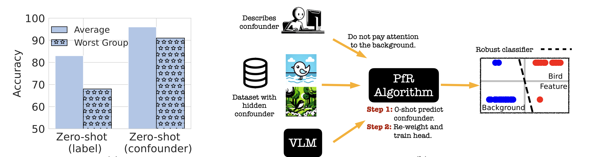

# Prompting is a Double-Edged Sword: Improving Worst-Group Robustness of Foundation Models


This code is the official implementation of [Prompting is a Double-Edged Sword: Improving Worst-Group Robustness of Foundation Models](https://arxiv.org/abs/). Here, we release our CXR-Drain dataset and code to reproduce our results. 


## Paper
For more details, refer to the accompanying paper: 
[Prompting is a Double-Edged Sword: Improving Worst-Group Robustness of Foundation Models](https://arxiv.org/abs/). If you have questions, please feel free to reach us at {asetlur, sgarg2}@andrew.cmu.edu or open an issue.  




If you find this repository useful or use this code in your research, please cite the following paper: 

> Setlur A., Garg S., Smith V., and Levine S. Prompting is a Double-Edged Sword: Improving Worst-Group Robustness of Foundation Models. (2024).
```
@article{setlur2024prompting,
    title={Prompting is a Double-Edged Sword: Improving Worst-Group Robustness of Foundation Models},
    author={Setlur, Amrith and Garg, Saurabh and Smith, Virginia and Levine, Sergey},
    year={2024}, 
    journal={}
}
```

## Datasets 

### CXR-Drain dataset

This dataset is created on top of the existing dataset available here: [CXR8](https://nihcc.app.box.com/v/ChestXray-NIHCC/folder/37178474737). Download the dataset using the script available here as [batch_download_zips.py](https://nihcc.app.box.com/v/ChestXray-NIHCC/file/371647823217). After setting up the images, refer to train and test splits available in `./CXR-Drain_dataset/`. 

## License
This repository is licensed under the terms of the [Apache License](LICENSE).